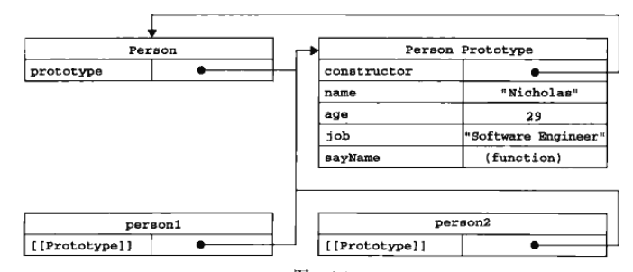

# 前言
	
本文主要总结了js面向对象编程的发展过程，参考高程三第六章。

---
# 工厂模式

最开始创建一个对象所使用的是工厂模式，因为js没有类的概念，所以通常会封装一个创建对象的函数。

```javascript
function createPerson(name,age,job){
	var o =new Object();
	o.name = name;
	o.age = age;
	o.job = job;
	o.sayName = function(){
		alert(this.name);
	};
	return o;
}

var person1 = createPerson('Nicholas',29,'Software Engineer');
var person2 = createPerson('Greg',27,'Doctor'); 
```

工厂模式虽然解决了重复创建固定属性的对象的问题，<strong style="color: red">但是没办法识别创建出的对象的类型</strong>。

---
# 构造函数模式
js支持创建自定义的构造函数，从而定义自定义对象类型的属性和方法。

```javascript
function Person(name,age,job){
	this.name = name;
	this.age = age;
	this.job = job;
	this.sayName = function(){
		alert(this.name);
	};
}

var person1 = new Person('Nicholas',29,'Software Engineer');
var person2 = new Person('Greg',27,'Doctor'); 
```

其中要创建Person的新实例，必须使用new操作符。用这种方式调用构造函数实际上会经历以下四个步骤：

* （1）创建一个新对象；
* （2）将构造函数的作用域赋给新对象（因此this就指向了这个新对象）；
* （3）执行构造函数中的代码（为这个对象添加属性）；
* （4）返回新对象。

这种创建对象的方式可以检测对象的类型：

```javascript
alert(person1 instanceof Object);   //true
alert(person1 instanceof Person);   //true
alert(person2 instanceof Object);   //true
alert(person2 instanceof Person);   //true
```

<strong style="color: red">但是这种模式创建的对象，每一个都具有sayName的方法，占用内存，无法实现函数的复用。</strong>

---
# 原型模式
我们创建的每一个函数都有一个prototype（原型）属性，这个属性是一个指针，指向一个对象。这个对象就是这个构造函数的原型对象，这个对象包含了所有实例所共享的属性和方法。

```javascript	
function Person(){
}

Person.prototype.name = 'Nicholas';
Person.prototype.age = 29;
Person.prototype.job = 'Software Engineer';
Person.prototype.sayName = function(){
	alert(this.name);
};

var person1 = new Person();
person1.sayName();   //'Nicholas'

var person2 = new Person();
person2.sayName();   //'Nicholas'

alert(person1.sayName == person2.sayName);  //true
```

这段代码中，person1和person2都调用了构造函数Person，所以它们有相同的属性和方法。在这里，Person叫做构造函数，Person.prototype叫做原型，person1和person2叫做实例。
	
可以用isPrototypeOf方法检测实例的原型：

```javascript
alert(Person.prototype.isPrototypeOf(person1));  //true

alert(Person.prototype.isPrototypeOf(person2));  //true
```

有一种更简便更直观的写法：

```javascript	
function Person(){
}

Person.prototype = {
	name : 'Nicholas',
	age : 29,
	job : 'Software Engineer',
	sayName : function(){
		alert(this.name);
	}
};

Object.defineProperty(Person.prototype,'constructor',{
	enumerable : false,
	value : Person
})
```

<strong style="color: red">需要注意的是，必须指定constructor为Person，不然会指向Object。</strong>
	
<strong style="color: red">同时，由于所创建的实例共享了所有属性与方法，这种共享性对方法和共有属性来说是适用的，但对于某些私有属性（尤其是引用类型值的属性）是不适用的，所以原型模式的缺点也显而易见：无法设置实例的私有属性。</strong>

---
# 组合使用构造函数模式和原型模式
	
这种模式结合了两种模式的优点，代码如下：

```javascript	
function Person(name,age,job){
	this.name = name;
	this.age = age;
	this.job = job;
	this.friends = ['shelby','court'];
}

Person.prototype = {
	sayName : function(){
		alert(this.name);
	}
};

var person1 = new Person('Nicholas',29,'Software Engineer');
var person2 = new Person('Greg',27,'Doctor'); 

person1.friends.push('Van');
alert(person1.friends);  //'shelby','court','Van'
alert(person2.friends);  //'shelby','court'
alert(person1.friends == person2.friends);  //false
alert(person1.sayName == person2.sayName);  //true
```

---
# 总结
	
首先讲讲new操作符都做了些什么（使用字面量定义对象的时候效果相同）：
	
* （1）创建一个新对象；
* （2）将构造函数的作用域赋给新对象（因此this就指向了这个新对象）；
* （3）执行构造函数中的代码（为这个对象添加属性）；
* （4）返回新对象。

这就相当于以下代码：

```javascript
var person1 = new Object();
function Person(){
	this.name = 'Klaus'; 
}

Person.call(person1);

alert(person1.name);  //'Klaus'
```

然后，再说说原型里面的各种指针问题：

* 构造函数Person   
* 原型Person.prototype   
* 实例person1
* Person.prototype.constructor  ==>  Person
* person1的[[prototype]]  ==>  Person.prototype  (由于这个属性是隐藏的不可访问，可以用Person.prototype.isPrototypeOf(person1)为true，或者person1.\__proto__  ==>  Person.prototype表示)
* 由于实例继承了原型的属性，所以person1.constructor  ==>  Person



最后，说说最终组合使用构造函数模式和原型模式创建对象的优点：

* 能够检测对象的类型；
* 能够传递参数，给每个对象设置私有的属性（尤其是引用对象类型的值）；
* 能够在原型中定义共享的属性和方法，节省了内存。

以下代码作为本篇文章的总结，基本可以说明所有问题：

```javascript
//可以给构造函数传递参数，给每个对象设置私有的属性（尤其是引用对象类型的值）
function Person(name,age,job){
	this.name = name;
	this.age = age;
	this.job = job;
	this.friends = ['shelby','court'];
}

//能够在原型中定义共享的属性和方法，节省了内存
//注意必须指定constructor属性，指向构造函数Person，不然会默认指向构造函数Object
Person.prototype = {
	constructor : Person,
	sayName : function(){
		alert(this.name);
	}
};

//创建新实例
var person1 = new Person('Nicholas',29,'Software Engineer');
var person2 = new Person('Greg',27,'Doctor'); 

//检测对象的类型
alert(person1 instanceof Person);  //true
alert(person2 instanceof Person);  //true
alert(person1 instanceof Object);  //true
alert(person2 instanceof Object);  //true

//检测原型
alert(Person.prototype.isPrototypeOf(person1));  //true
alert(Person.prototype.isPrototypeOf(person2));  //true

//检测constructor属性
alert(Person.prototype.constructor);  //function Person(){}

//注释掉constructor属性的那行代码后
alert(Person.prototype.constructor);  //function Object(){}

//对实例的私有属性进行操作，不会影响其他实例的属性
person1.friends.push('Van');
alert(person1.friends);  //'shelby','court','Van'
alert(person2.friends);  //'shelby','court'

//再次证明了私有属性是每个实例所特有的，而继承原型的属性是共享的
alert(person1.friends == person2.friends);  //false
alert(person1.sayName == person2.sayName);  //true
```

如果哪里有错误的话请留下评论，我会及时更正，谢谢观看。