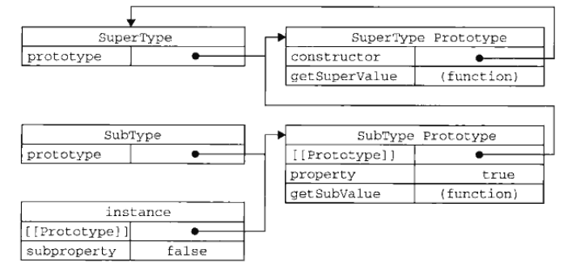

# 前言

本篇文章继续讲js原型和继承，参考高程三第六章。

---

# 原型链

先上一段代码（继承）：

``` javascript
function SuperType(){
	this.property = 'super';
}

SuperType.prototype.getSuperValue = function(){
	return this.property;
}

function SubType(){
	this.subproperty = 'sub';
}

//继承了SuperType
SubType.prototype = new SuperType();

SubType.prototype.getSubValue = function(){
	return this.subproperty;
}

var instance = new SubType();
alert(instance.getSuperValue());  //super
alert(instance.getSubValue());  //sub

//检测实例对象的类型
alert(instance instanceof Object);  //true
alert(instance instanceof SuperType);  //true
alert(instance instanceof SubType);  //true
```

其中的`SubType.prototype = new SuperType();`可以这么理解：sub实例的爸爸（原型）= super的实例，所以sub实例的爷爷 = super实例的爸爸（原型），他们的继承关系就是`SuperType.prototype==>SubType.prototype(new SuperType())==>new SubType()`。

所以它们之间的指针关系如图：



<strong style="color: red">注意：</strong>
* 想要修改SubType的原型的话，要在`SubType.prototype = new SuperType();`语句之后写（之前写的话，这一条赋值语句会修改SubType.prototype的指针，相当于之前写的都没用了）。
* 修改SubType.prototype的时候不能用字面量定义，因为那样会重写SubType.prototype，也就相当于SubType和SuperType毫无关系了。
* 调用instance实例的属性或者方法的时候，首先先查找instance实例（SubType），然后向上查找SubType.prototype，然后继续向上查找SuperType.prototype和SuperType。

而这种原型链构造新对象的方法也有其缺点：

* 无法给SuperType构造函数传递参数
* SuperType和SuperType.prototype的所有属性和方法都被SubType的实例共享，如果有一些私有属性或者说引用类型的值作为属性就很蛋疼了（引用类型值因为是指针调用，所以一个实例修改，所有实例都会被修改）

为了解决这些问题，于是便有了借用构造函数模式。

---

# 借用构造函数

这种技术的思路非常简单，就是在子类型的构造函数内调用了超类型的构造函数，代码如下：

``` javascript
function SuperType(name){
	this.name = name;
}

function SubType(name,age){
	SuperType.call(this,name)
	this.age = age
}

var instance = new SubType('Klaus',22);
alert(instance.name);  //Klaus
alert(instance.age);  //22

//检测类型
alert(instance instanceof Object);  //true
alert(instance instanceof SuperType);  //false
alert(instance instanceof SubType);  //true
```

这种模式可以给超类型构造函数传递参数，超类型属性也全都是实例私有的，但是这种模式缺点也很明显：

* 新建实例无法调用SuperType.prototype的属性和方法
* 因此，超类型中需要共享的方法必须放在超类型构造函数中而不能放在其原型中，所以函数的复用无从谈起
* 因为子类型和超类型没有继承关系，只是简单的调用，所以实例并不属于超类型的对象

---

# 组合继承

这种模式结合了原型链模式和借用构造函数模式的优点，代码如下：

``` javascript
function SuperType(name){
	this.name = name;
	this.color = ['red','green'];
}

SuperType.prototype.sayName = function(){
	alert(this.name);
}

function SubType(name,age){
	SuperType.call(this,name);
	this.age = age;
}

//SubType继承了SuperType
SubType.prototype = new SuperType();

SubType.prototype.sayAge = function(){
	alert(this.age);
}

var instance1 = new SubType('Klaus',22);
instance1.sayName();  //Klaus
instance1.sayAge();  //22
instance1.color.push('blue');
alert(instance1.color);  //red,green,blue

var instance2 = new SubType('nico',25);
instance2.sayName();  //nico
instance2.sayAge();  //25
alert(instance2.color);  //red,green

//检测实例对象的类型
alert(instance1 instanceof Object);  //true
alert(instance1 instanceof SuperType);  //true
alert(instance1 instanceof SubType);  //true
alert(Object.prototype.isPrototypeOf(instance1));  //true
alert(SuperType.prototype.isPrototypeOf(instance1));  //true
alert(SubType.prototype.isPrototypeOf(instance1));  //true
```
	
---

# 原型式继承

原型式继承方式是道格拉斯提出来的一种实现继承的方法，它的代码是这样的：

``` javascript 
function object(o){
	function F(){}
	F.prototype = o;
	return new F();
}
```
 
这一段代码的可以这么理解，把F看做上面所讲代码的子类型，o看做超类型，子类型继承了超类型，函数最后返回了F的实例。

有了这段代码，我们就可以不定义子类型的构造函数（其实在object函数中定义了，只不过执行完被垃圾回收了而已）就直接得到继承。

后来，这种原型式继承被ECMAScript规范化了，并定义成了`Object.create()`方法，这个方法接受两个参数，第一个是被继承的对象o（可以理解为超类型构建函数），第二个是新建对象的私有属性（可以理解为子类型的构建函数），第二个参数的格式类似于`Object.defineProperties()`方法需要传入的参数格式。

使用形式类似于`var sub = Object.create(super)`，但是别忘了继承的属性都是共享的。

---

# 寄生式继承

寄生式继承也是道格拉斯提出来了，代码如下：

``` javascript
function createAnother(original){
	var clone = object(original);  //原型式继承创建对象
	clone.sayHi = function(){	   //给新创建的对象添加私有属性和方法
		alert('Hi!');
	};
	return clone;
}
```

现在这种方法完全可以用`Object.defineProperties()`方法替代：

``` javascript
var clone = Object.create(original,{
	sayHi : {
		value : function(){
			alert('Hi!');
		}
	}
})

clone.sayHi();  //hi!
```

这种方法和构造函数一样，会因为函数不能复用而使效率降低。

---

# 寄生组合式继承

前面介绍的组合继承模式是比较完美的，但是它仍然有一点不足，因为它会两次调用SuperType()，看代码：

``` javascript
function SuperType(name){
	this.name = name;
	this.color = ['red','green'];
}

SuperType.prototype.sayName = function(){
	alert(this.name);
}

function SubType(name,age){
	SuperType.call(this,name);  //第二次调用
	this.age = age;
}

//SubType继承了SuperType
SubType.prototype = new SuperType();  //第一次调用
SubType.prototype.constructor = SubType;
SubType.prototype.sayAge = function(){
	alert(this.age);
}
```

第一次调用会使子类型的原型带有超类型构造函数中定义的属性和方法，第二次调用会使子类型实例带有超类型构造函数中定义的属性和方法，这就造成了重复，两次定义了相同的属性，造成了浪费。

寄生组合式继承就完美解决了这个问题：

``` javascript
function object(o){
	function F(){}
	F.prototype = o;  
	return new F(); 
}

function inheritPrototype(subType,superType){
	var prototype = object(superType.prototype);
	prototype.constructor = subType;
	subType.prototype = prototype;
}

function SuperType(name){
	this.name = name;
	this.color = ['red','green'];
}

SuperType.prototype.sayName = function(){
	alert(this.name);
}

function SubType(name,age){
	SuperType.call(this,name);
	this.age = age;
}

//SubType继承了SuperType
inheritPrototype(SubType,SuperType);

SubType.prototype.sayAge = function(){
	alert(this.age);
}

var instance1 = new SubType('Klaus',22);
instance1.sayName();  //Klaus
instance1.sayAge();  //22
instance1.color.push('blue');
alert(instance1.color);  //red,green,blue

var instance2 = new SubType('nico',25);
instance2.sayName();  //nico
instance2.sayAge();  //25
alert(instance2.color);  //red,green

//检测实例对象的类型
alert(instance1 instanceof Object);  //true
alert(instance1 instanceof SuperType);  //true
alert(instance1 instanceof SubType);  //true
alert(Object.prototype.isPrototypeOf(instance1));  //true
alert(SuperType.prototype.isPrototypeOf(instance1));  //true
alert(SubType.prototype.isPrototypeOf(instance1));  //true

//检测子类型原型有没有继承超类型构造函数中的name和color属性
alert(instance1.hasOwnProperty('name'));  //true
alert(SubType.prototype.hasOwnProperty('name'));  //false
alert(instance1.hasOwnProperty('color'));  //true
alert(SubType.prototype.hasOwnProperty('color'));  //false
```
	
现在我们来理一下他们之间的关系：
* F的原型=o
* object(o)返回F的实例，也就是object(o)=F的实例
* prototype=object(superType.prototype)，也就是说prototype=F的实例，F的原型是superType.prototype
* subType的原型=prototype

<strong style="color: red">把它们连接起来就是：</strong>
* subType的原型 = prototype = object(superType.prototype) = F的实例
* F的原型 = o = superType.prototype

<strong style="color: red">这两个个等式只要看开头和结尾就可以了。第一个等式显示要继承的子类型的原型为一个构造函数F（中间量）的实例，这样，子类型的原型就完美继承了F的构造函数和原型所有的属性和方法，和我们上面讲的原型链中的`SubType.prototype = new SuperType();`语句是一样的作用。</strong>

<strong style="color: red">下面的等式，F的原型是superType的原型，即超类型的原型，使F继承到了超类型原型里的方法和属性，而没有继承到超类型构造函数里的属性和方法。</strong>

总结下来就是：subType的原型继承了F构造函数和原型中所有的属性和方法，F的原型继承了superType的原型而没有继承到superType的构造函数，而F的构造函数在object函数中被定义为没有任何的属性和方法。

废了这么大劲，与上面讲的组合继承有什么不同呢？

他们的最大不同就在于F这个中间量，因为有了这个中间量，使SubType的原型不需要继承SuperType的构造函数中的属性和方法，只继承到了SuperType原型中的属性和方法，所以解决了那个前面提到的“两次定义了相同的属性”的问题。

---

# 总结

经过这一系列的演变，最后得出的结论是，最好的继承方式就是寄生组合继承。

当然，从原型式继承被ECMAScript规范化了，并定义成了`Object.create()`方法后，寄生组合继承还可以被简写：

``` javascript
function inheritPrototype(subType,superType){
	var prototype = Object.create(superType.prototype);  //用Object.create()方法替代了原来的objec()方法
	prototype.constructor = subType;
	subType.prototype = prototype;
}

function SuperType(name){
	this.name = name;
	this.color = ['red','green'];
}

SuperType.prototype.sayName = function(){
	alert(this.name);
}

function SubType(name,age){
	SuperType.call(this,name);
	this.age = age;
}

//SubType继承了SuperType
inheritPrototype(SubType,SuperType);

SubType.prototype.sayAge = function(){
	alert(this.age);
}

var instance1 = new SubType('Klaus',22);
instance1.sayName();  //Klaus
instance1.sayAge();  //22
instance1.color.push('blue');
alert(instance1.color);  //red,green,blue

var instance2 = new SubType('nico',25);
instance2.sayName();  //nico
instance2.sayAge();  //25
alert(instance2.color);  //red,green

//检测实例对象的类型
alert(instance1 instanceof Object);  //true
alert(instance1 instanceof SuperType);  //true
alert(instance1 instanceof SubType);  //true
alert(Object.prototype.isPrototypeOf(instance1));  //true
alert(SuperType.prototype.isPrototypeOf(instance1));  //true
alert(SubType.prototype.isPrototypeOf(instance1));  //true

//如果需要重新追加新的共享方法和属性，可以向SuperType.prototype或者SubType.prototype追加，追加的属性方法可以被所有的子类型实例共享，非常方便
SuperType.prototype.sayHi = function(){
	alert('Hi!');  
}

instance1.sayHi();  //Hi!

//检测子类型原型有没有继承超类型构造函数中的name和color属性
alert(instance1.hasOwnProperty('name'));  //true
alert(SubType.prototype.hasOwnProperty('name'));  //false
alert(instance1.hasOwnProperty('color'));  //true
alert(SubType.prototype.hasOwnProperty('color'));  //false
```

这篇文章可能讲的不是太清楚，因为太复杂了，很难讲清楚，需要自己慢慢思考领悟，经过这么多绕来绕去的继承，最后肯定能领会到继承的真谛。

如果哪里有错误的话请留下评论，我会及时更正，谢谢观看。

---

# 2017.3.9补充

在群里讨论了原型与继承的问题，有一个小伙伴画了一张图能够更好地理解原型链的结构，在这里贴上地址：https://www.processon.com/view/link/586c6f75e4b067ce853bb863