# 前言

最近重新捡起了博客，用最简单的hexo+Github Page重新搭了静态的博客，用了next的主题，也踩了不少坑。这里写了从零到一完全搭建过程，以帮助其他人，避免踩坑。

# 准备工作

## 安装Git和node.js

首先，需要安装node.js和Git，过程比较简单，这里就不具体介绍了，最后别忘了配置环境变量。

* [Git](https://git-scm.com/)
* [node.js](https://nodejs.org/en/)

为了更快地下载，安装npm的淘宝镜像。

```
$ npm install -g cnpm --registry=https://registry.npm.taobao.org
```

## 安装hexo

打开命令行，安装hexo，然后配置环境变量。

```
$ cnpm install -g hexo-cli
```

我在这里把文件目录放在D盘根目录。

```
$ hexo init blog
$ cd blog
$ cnpm install
$ hexo s
```

访问本地4000端口，如果能访问到博客页面，则证明安装成功。按`Ctrl`+`C`结束本地服务。

接下来安装next主题。

```
$ git clone https://github.com/iissnan/hexo-theme-next themes/next
```

## 注册Github并新建库

[Github](https://github.com/)注册的话比较简单就不介绍了，注册好登录后新建一个库以后用来放博客项目。

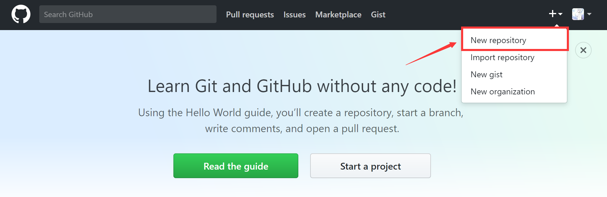

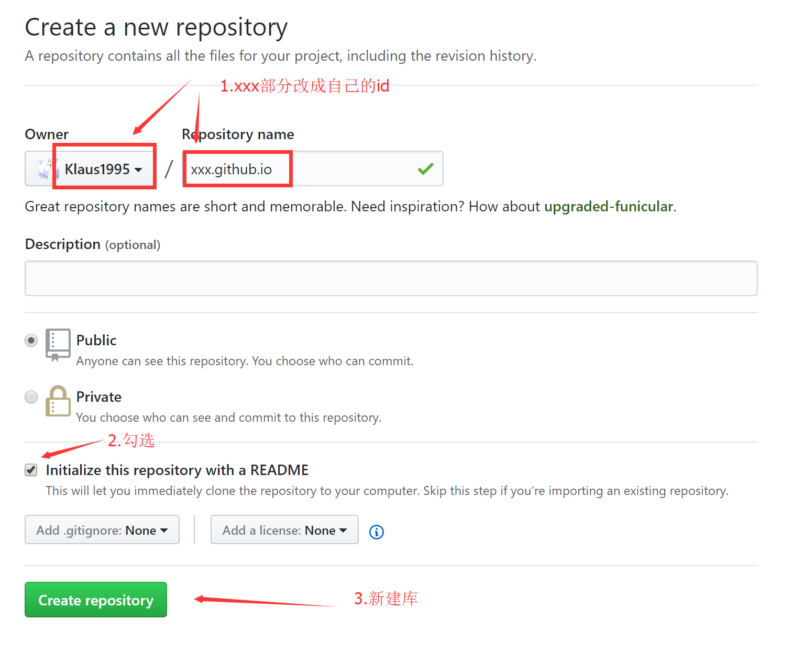

建好仓库之后，点击进入该仓库，修改设置，开启Github Page。

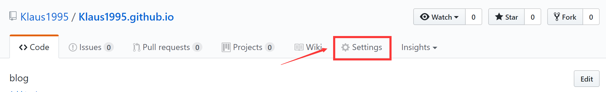

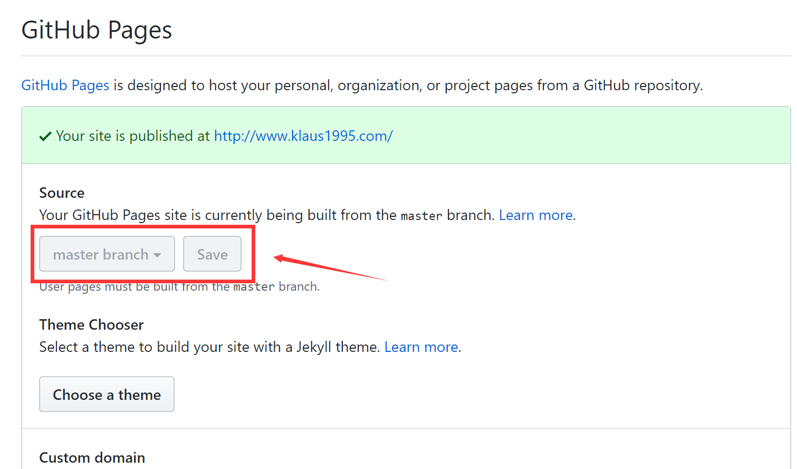

# 配置hexo

## 配置hexo配置文件

首先修改hexo的配置文件，打开刚才新建的blog文件夹，打开根目录的_config.yml配置文件，根据自己的需求修改：

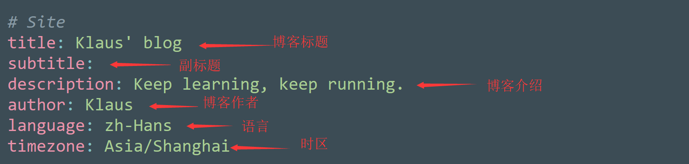

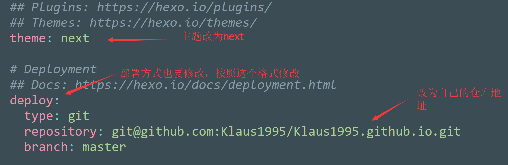

具体的仓库地址要在自己的github仓库页面上看。

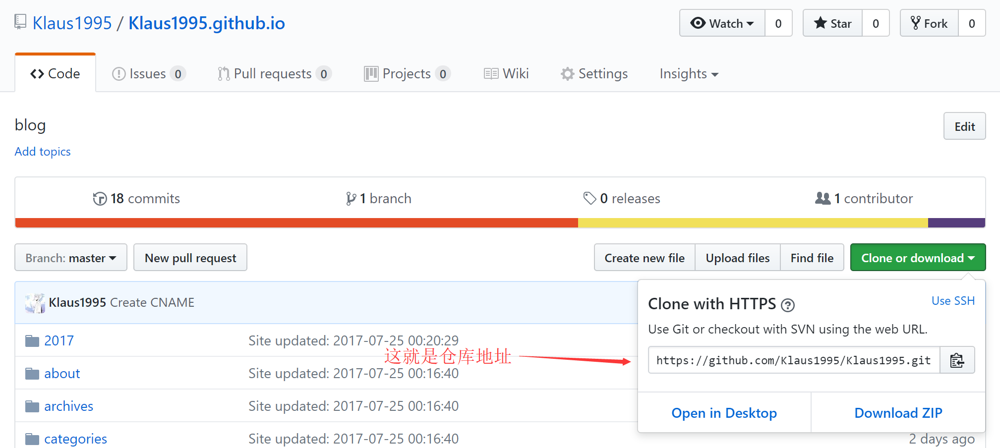

目前为止，hexo的配置已经修改好了，接下来要修改next主题的配置。

## 配置next主题配置文件

打开blog\themes\next文件夹下的_config.yml配置文件：

* menu属性指的是博客主页上的主要分页，不需要的在最前面加#注释掉。

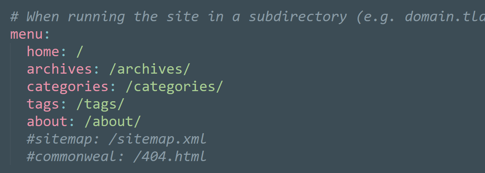

* schema属性指的是next主题的三个类型，可以都试一下，选择一个自己喜欢的。

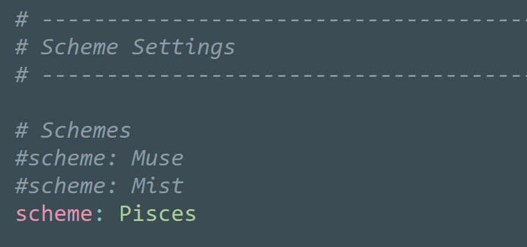

* social属性是自己其他社交网站的链接。

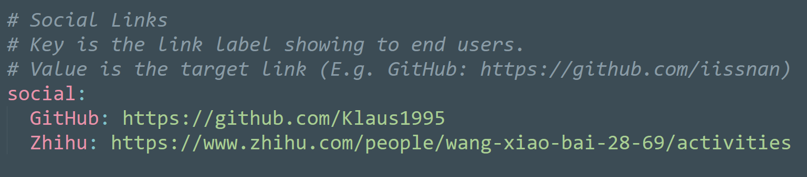

* avatar是自己的头像，图片文件需要放在blog\themes\next\source\images目录下。

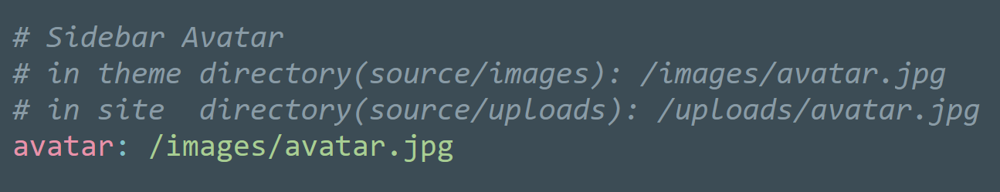

* disqus属性是评论功能，开启以后需要科学上网才能看到。

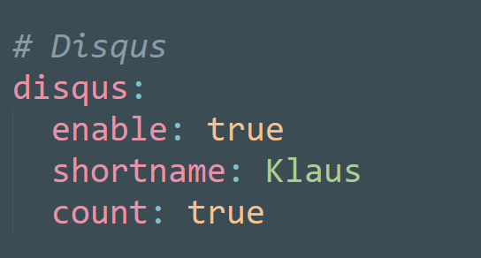

这些就是一些主要的配置，其他的配置可以阅读hexo和next的官方文档自行尝试。

* [hexo](https://hexo.io/)
* [next](http://theme-next.iissnan.com/)

不喜欢next主题的可以尝试别的主题，配置都大同小异。

* [hexo主题](https://hexo.io/themes/)

# hexo使用方法

首先，在blog文件夹根目录按`Shift`+鼠标右键打开命令行，新建文章。

```
$ hexo n "文章标题"
```

然后打开source\_posts文件夹，找到相应的md文件，打开编辑。文档采用的是markdown的语法。

* [markdown](http://www.appinn.com/markdown/)

写完保存成功后，命令行执行生成命令。

```
$ hexo g
```

生成成功后，接下来进行部署。

```
$ hexo d
```

部署成功后，就可以访问自己的博客啦，博客默认地址是yourGithubName.github.io。

至于如何设置博客的小图标、修改代码块显示风格、代码高亮、如何在博文中插入图片、如何把博客地址绑定为自定义域名之类的问题，可以自行google或者私下问我，感谢观看！