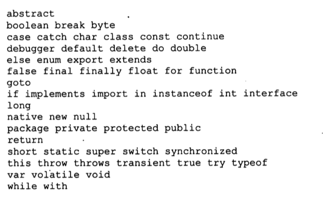
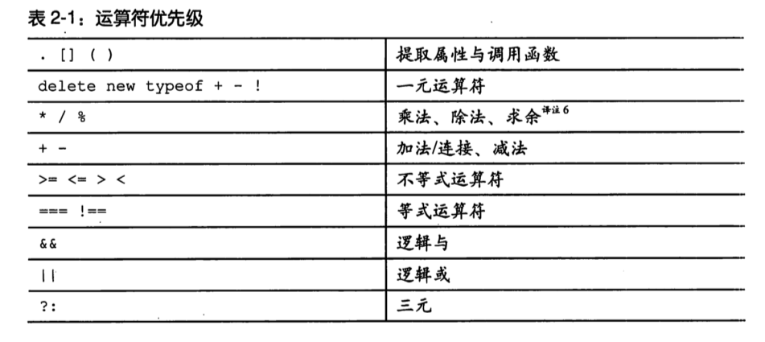

# 前言

因为最近没有在写什么项目，于是打算把《javascript语言精粹》看一遍，顺便写个总结笔记，本文只记载了我觉得可能要记下来的东西。

# 第一章 精华

## 为什么要使用JavaScript

## 分析JavaScript

## 一个简单的试验场

本书贯彻始终会使用一个method方法去定义新方法。

	``` javascript
	Function.prototype.method = function (name, func) {
		this.prototype[name] = func;
		return this;
	};
	```

# 第二章 语法

## 空白

建议使用`//`来注释，避免使用`/* */`，因为有的正则表达式可能会造成问题，例如：

``` javascript
	/* 
	    var rm_a = /a*/.match(s);
	*/
```

## 标识符

不允许用保留字来命名变量或者参数。



## 数字

JavaScript只有一个数字类型，内部表示为64位浮点数。

NaN不等于任何值（包括它自己），可以用函数isNaN(number)检测。

## 字符串

字符串一旦被创建，就永远无法改变它，后续的修改只是创建了新的字符串而不是在其本身进行修改。

这也就是从前讲优化的时候有一个点是，对于字符串的相加操作建议用数组方法替代，就像这样：

``` javascript
	var mychar = 'a' + 'b' + 'c';

	//建议替换为数组操作
	var myArr = [];
	myArr.push('a');
	myArr.push('b');
	myArr.push('c');
	var myChar = myArr.join('');
```

不过好像是由于浏览器和引擎的内部优化，一般不会造成太大影响，所以现在基本不怎么提了，也不怎么用吧好像。

## 语句

可以通过条件语句（if和switch）、循环语句（while、for和do）、强制跳转语句（break、return和throw）和函数调用来改变执行序列。

for in语句会遍历对象的所有可枚举属性（包括继承的），所以如果只想要遍历属性自己的属性，可加一步判断。

``` javascript
	for (myVar in obj) {
		if (obj.hasOwnProperty(myVar)) {
			...
		}
	}
```

do和while的区别就是do至少会执行一次循环体里面的代码。

try catch语句会捕获try代码块中的异常，并自动跳转到catch代码块执行其中的代码。

throw语句就是认为抛出一个异常，如果throw语句在函数中，则函数调用被放弃。

break语句可以跳出循环，continue语句可以跳过循环体中后续代码，直接执行下次循环。

可以给循环加label，然后break label跳出特定循环，在复杂的循环中可能会用到。

各种运算的优先级：



## 字面量

## 函数

# 第三章 对象

## 对象字面量

对象字面量提供了一种非常方便地创建新对象值的表示法。

对象的属性名可以是包括空字符串在内的任意字符串，一般不用引号括住，但是如果是保留字或者非法的标识符（例如first-name是非法的，first_name就是合法的），就必须用引号括住。

对象可以嵌套。

## 检索

获取对象的某个属性值，一般用 `.propertyName` 表示法，但是如果属性名不是合法的标识符，则需要用`['propertyName']`表示。

如果检索了对象的不存在的属性，返回`undefined`。

如果检索了`undefined`的某个属性，会抛出TypeError异常。

## 更新

给对象的某个属性赋值，如果对象存在这个属性，则覆盖属性原来的值，不存在的话，则创建属性并赋值。

## 引用

对象是引用类型值，只会被引用，不会被复制（除非用一些特定的方法函数）。

## 原型

想要具体了解原型可以看我关于原型的博客文章[JS原型](https://klaus1995.github.io/2017/03/06/JS%E5%8E%9F%E5%9E%8B/)。

然后推荐一本书[你不知道的JavaScript（上卷）](https://book.douban.com/subject/26351021/)，书中也对原型有了非常深刻的讲解，我觉得讲得非常好。

## 反射

## 枚举

for in语句可以遍历对象的所有可枚举属性，属性名出现的顺序是不确定的。

## 删除

delete运算符可以用来删除对象的属性。如果对象包含该属性，那么该属性就会被移除。它不会触及原型链中的任何对象。

## 减少全局变量污染

在没有必要的情况下应该尽量减少全局变量的使用。

# 第四章 函数

## 函数对象

函数就是对象。每个函数在创建时会附加两个隐藏属性：函数的上下文和实现函数行为的代码。

每个函数对象在创建时也随配有一个prototype属性。它的值时一个拥有constructor属性且值为该函数的对象。

## 函数字面量

## 调用

函数有4种调用模式：方法调用模式、函数调用模式、构造器调用模式和apply调用模式。这些模式在如何初始化关键参数this上存在差异。

## 方法调用模式

当一个函数被保存为对象的一个属性时，我们称它为一个方法。当一个方法被调用时，this绑定到该对象。

## 函数调用模式

当一个函数并非一个对象的属性时，那么它就是被当做一个属性来调用的。

以此模式调用函数时，this被绑定到全局对象。

## 构造器调用模式

如果在一个函数前面带上new来调用，那么背地里将会创建一个连接到该函数的prototype成员的新对象，同时this会被绑定到那么新对象上。

一个函数，如果创建的目的就是希望结合new前缀来调用，那它就被称为构造器函数。按照约定，构造器函数的函数名为大写字母开头。

## Apply调用模式

apply方法让我们构建一个参数数组传递给调用函数。它也允许我们选择this的值。apply方法有两个参数，第一个是要绑定给this的值，第二个就是一个参数数组（不想用参数数组的可以用call方法）。

## 参数

当函数被调用时，会得到一个“免费”配送的参数，那就是arguments数组。函数可以通过此参数访问所有它被调用时传递给它的参数列表。

arguments并不是一个真正的数组，是一个类数组对象，拥有length属性，但是没有任何数组的方法。

## 返回

return语句可用来使函数提前返回。如果没有指定返回值，则返回undefined。

如果函数调用时在前面加上了new前缀，且返回值不是一个对象，则返回this（该新对象）。

##异常

throw语句中断函数的执行，并抛出一个异常（exception对象，通常包含一个name属性和一个message属性，当然也可添加其他属性）。

该异常可以被catch捕获。

## 扩充类型的功能

JavaScript允许给语言的基本类型扩充功能，通过给prototype添加方法，使该类型值都能使用该自定义方法。

## 递归

递归函数就是会直接或间接调用自身的一种函数。

请使用尾递归优化，详见阮一峰的《ES6入门》。

## 作用域

JavaScript没有块状作用域，只有函数作用域。

ES6中新增了let和const可以定义块状作用域内的变量。

## 闭包

作用域的好处就是内部函数可以访问定义它们的外部函数的参数和变量（除了this和arguments）。

函数嵌套函数，内部函数可以访问它被创建时所处的上下文环境，这被称为闭包。

## 回调

## 模块

模块是一个利用函数和闭包构造的提供接口却隐藏状态与实现的函数或对象。

## 级联

如果设置函数方法返回值是this，就可以启用级联。就是函数的连续调用，类似于jQuery。

## 柯里化

## 记忆

# 第五章 继承

<--!未完待续-->