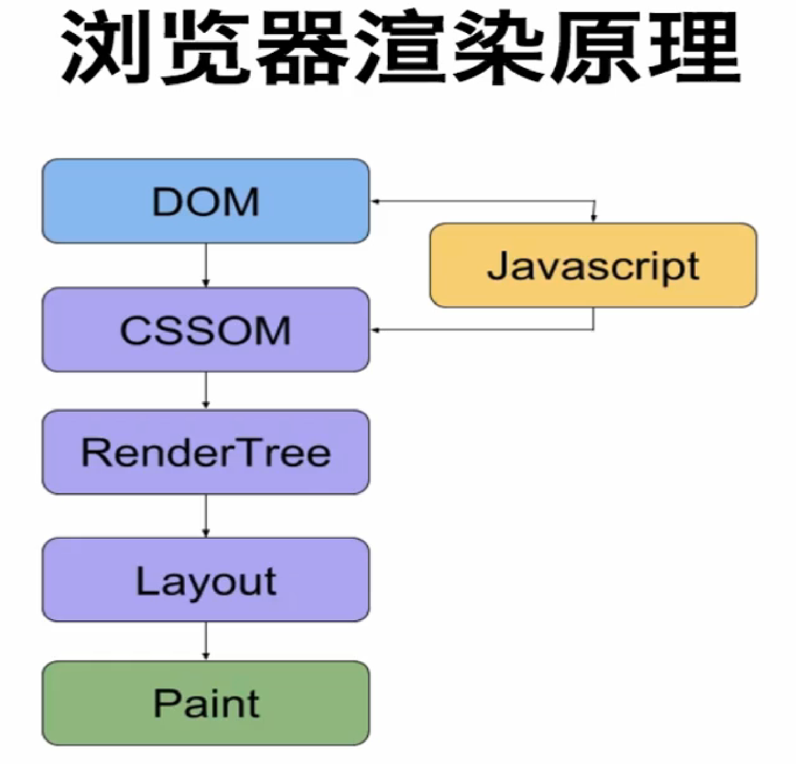
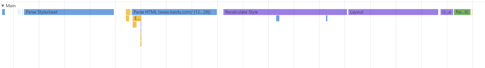
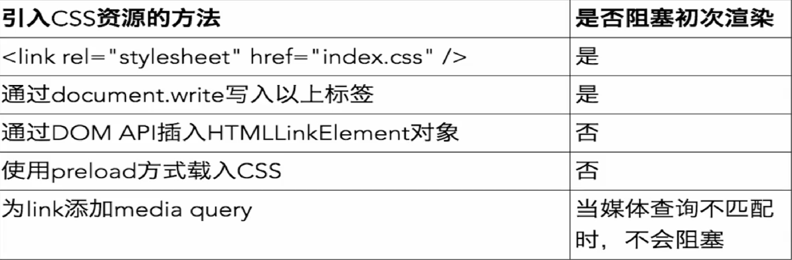
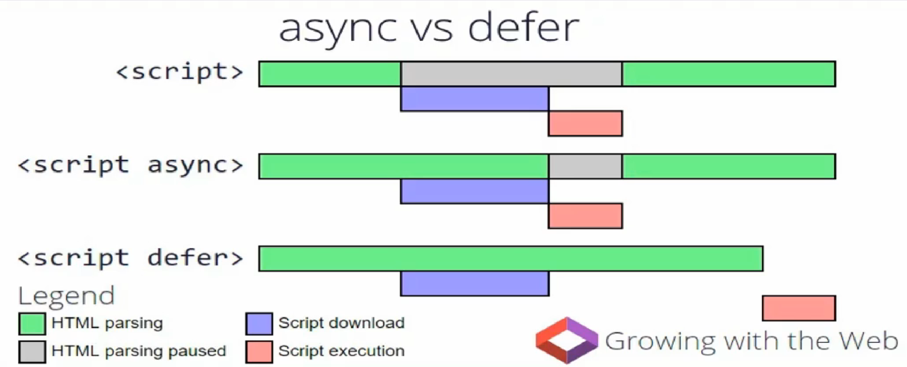
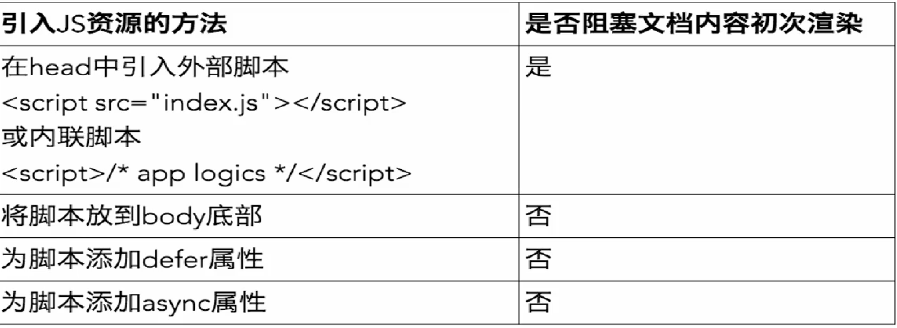

# 前言

本文主要是介绍了WEB关键渲染路径性能优化，是我在观看360奇舞团相关课程之后的一个总结，想要观看视频的请点击[视频播放地址](https://t.75team.com/video/play?id=65_260_2017032010370819aadb47-c79c-4d63-afd4-df0b42eaee48)。

# 浏览器的渲染原理

## 基本渲染过程

由图可以看出基本渲染过程，过程可以在Chrome开发者工具中的Timeline中进行查看。

1. 首先浏览器会解析HTML文档，生成相应的DOM树。
2. 然后浏览器会解析文档的样式，生成CSSOM。
3. 在以上两步中穿插着js的代码解析。
4. 然后浏览器会结合解析完的DOM和CSSOM，生成一个RenderTree。
5. 再然后，浏览器会根据生成的RenderTree进行相应的计算分给每个元素的空间大小以及相应的位置，进行Layout。
6. 最后，会具体渲染每个元素的细节部分，也就是Paint。

这是我加载百度首页时截的部分图，可以简单看出渲染过程。

## Parse HTML to DOM

这个过程就是将请求得到的HTML文档解析生成DOM树。

注意：

* 浏览器的解析过程是**增量构建**的，即浏览器无需等待HTML加载完毕，便可开始解析DOM。

## Parse Stylesheet to CSSOM

这个过程就是将的到的HTML中的style标签中的内容以及下载的css文件解析为CSSOM的过程，类似于生成DOM的过程。

注意：

* css选择器越详细，匹配速度越慢。

##  Recalculate Style

浏览器会将上两步得到的结果相结合，生成RenderTree。

注意：

* RenderTree包含了渲染页面所需要的节点。
* 无需渲染的节点不会被添加到RenderTree里，例如html和head节点，以及display:none的节点。
* visibility:hidden的节点会被渲染，因为他虽然不可见，但是在页面中占有一定的位置。

## Layout

这个过程就是浏览器计算渲染树节点的位置和大小。

注意：

* 可以设置viewport来设置浏览器的理想窗口（一般应用在移动端）。通过在HTML中加入`<meta name="viewport" content="width=device-width">`来设置理想窗口，如果不设置一般默认980px。
* 触发Layout的条件（不全）：
1. 屏幕旋转
2. 浏览器视窗的变化
3. 与大小位置相关的CSS属性的变化

## Paint

这个过程就是具体的填充过程，也就是渲染例如颜色等等样式。

## 补充内容

Layout和Paint是两个不同的过程，与之相关的就是我们经常说到的回流（reflow）与重绘（repaint），如果想要了解这方面具体的内容，可以看张鑫旭翻译的这篇文章[回流与重绘：CSS性能让JavaScript变慢？](http://www.zhangxinxu.com/wordpress/2010/01/%E5%9B%9E%E6%B5%81%E4%B8%8E%E9%87%8D%E7%BB%98%EF%BC%9Acss%E6%80%A7%E8%83%BD%E8%AE%A9javascript%E5%8F%98%E6%85%A2%EF%BC%9F/)

另外，CSS也是增量构建的，但不是增量渲染的，它只会在所有样式都构建完成以后统一渲染（因为后面设置的样式会将前面设置的样式覆盖掉），然后生成RenderTree。

# 资源对渲染的影响

## 资源类型

资源类型有很多，最常见的是：

* CSS
* JS
* font
* img

## CSS

首先，页面会在加载DOM和CSSOM之后开始初次渲染页面，而不是加载完DOM就立即开始渲染，这就造成了CSS 阻塞初次渲染的现象。

注意：

* 通过``和`<link rel="stylesheet" href="index.css">`定义的CSS，均会阻塞初次渲染。
* 浏览器会在解析CSS完成之后进行初次渲染，这是为了防止样式突变带来的抖动。
* 不管CSS出现在文档的哪个位置，都会阻塞整个文档的初次渲染。
* 通过link标签引入的CSS阻塞的时间可能更长，因为加载它需要一个网络来回时间。

媒体查询：

* `<link rel="stylesheet" href="index_print.css" media="print">`
* 此样式表仍会加载
* 当浏览器环境不匹配媒体查询条件时，该样式表不会阻塞渲染
* 我们可以针对不同的媒体环境拆分CSS文件，并为link标签添加媒体查询，避免为了加载非关键CSS资源，而阻塞了初次渲染

各种加载CSS的方法：

但是请注意，虽然有的方法不会阻塞初次渲染，但是会在后来加载完CSS文件以后使页面产生一个巨大的抖动（渲染样式）。

## JS

在HTML中加载JS代码会阻塞初次渲染。

注意：

* 通过``标签和外部引用JS文件均会阻塞HTML parser，因而会阻塞出现在脚本后面的HTML标记的渲染。
* 通过外部引入的JS文件阻塞的时间可能更长，因为加载它需要一个网络来回时间。
* JS可以修改DOM，所以在加载JS代码的时候，浏览器会停止解析DOM的工作。

同时，CSS也会阻塞JS。这是因为JavaScript可能会读取和修改CSSOM，因此要等到CSSOM构建完成之后，JS才会执行。

两个并列的外部引用的JS文件会同时进行加载（不是解析），这是因为JS虽然会阻塞HTML parser，停止DOM的构建工作，但是浏览器会去识别脚本后面的资源，并提前加载。

因此，可以通过把``标签放到文档最后，或者用defer和async属性来解决JS加载对HTML parser的阻塞。defer和async属性有差异，具体看下图：

各种加载JS的方法：

## font

在加载完HTML文档后，浏览器会等待字体文件加载完成后，才会显示具体内容（应用了该字体的元素）。

通过preload异步加载CSS字体文件，就不会阻塞初次渲染。

## img

图片文件并不会阻塞初次渲染。

# 优化关键渲染路径

## 优化目标

将以下指标压缩到最低：

* 关键资源数
* 关键资源体积
* 关键资源网络来回数

## 优化方法

* 上面提到的为了防止阻塞的各种方法。
* 部分CSS和JS使用内联以减少关键资源数和关键资源网络来回（请勿盲目使用内联）。
* http2主动推送所需要的资源（目前支持并不好）。
* 利用缓存和内联（第一次用内联优化，以后就利用缓存）。
* 各种类型的文件压缩。
* 服务器优化。
* 合理利用缓存，优化网络。

如果哪里有错误的话请留下评论，我会及时更正，谢谢观看。
